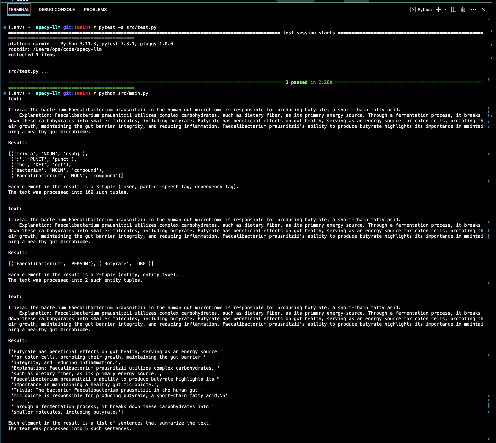

# spacy-llms: augmenting nlp pipelines

a integration of spacy's components with Large Language Models (LLMs) to boost text processing, entity extraction, NER, and summarization. Includes unit and integration tests, fixtures, and samples.

enabling NLP pipelines with Large Language Models (LLMs), combining spacy's supervised learning or rule-based components with LLM-powered features.




## installation

the installation steps suit a config:

macos/osx</br>
arm/m1, -`conda`</br>
cpu</br>
virtual environment</br>
english</br>
efficiency</br>
[spacy-quickstart ⩩ ](https://spacy.io/usage#quickstart) other configs

activate virtual environment and install spacy:

terminal:

```shell
conda create -n venv
conda activate venv
conda install -c conda-forge spacy
python -m spacy download en_core_web_sm
python -m spacy validate
```

`en_core_web_sm`: a small English model trained on web text.

`en_core_web_trf`: for accuracy, use a transformer-based model.

i.e.

```shell
python -m spacy download en_core_web_trf
```

see [spacy models ⩩ ](https://spacy.io/models/en#en_core_web_sm)

## 🏁 start run:

```shell
pytest src/test.py
python src/main.py
python src/get_top_ranked_phrases.py
```

## features

✔︎ `load_model()` loads the spacy model. returns the model. i.e. `spacy.load("en_core_web_sm")`

✔︎ `process_text_returns_expected_tuples(nlp, text)`: loads the spacy model, processes text. returns expected tuples. i.e. `[(token, POS, dependency)]`

✔︎ `extract_entities_returns_expected_entity_tuples(nlp, text)` identifies named entities in text. returns expected entity tuples. i.e. `[(entity, label)]`

✔︎ `summarize_text_returns_expected_summary(nlp, text)` generates a summary of text by extracting important phrases. returns expected summary. i.e. 'summary'

✔︎ `get_top_ranked_phrases(text)` extracts top ranked phrases from text. returns expected phrases. i.e. `[(phrase, rank)]`

✔︎ `@pytest.fixture`

✔︎ `textrank`

✔︎ `pytextrank`

✔︎ `pytest`

## samples

### `butyrate_text`

```python
butyrate_text = """Trivia: The bacterium Faecalibacterium prausnitzii in the human gut microbiome is responsible for producing butyrate, a short-chain fatty acid.
Explanation: Faecalibacterium prausnitzii utilizes complex carbohydrates, such as dietary fiber, as its primary energy source. Through a fermentation process, it breaks down these carbohydrates into smaller molecules, including butyrate. Butyrate has beneficial effects on gut health, serving as an energy source for colon cells, promoting their growth, maintaining the gut barrier integrity, and reducing inflammation. Faecalibacterium prausnitzii's ability to produce butyrate highlights its importance in maintaining a healthy gut microbiome."""
```

### `geosynchronization_text`

```python
geosynchronization_text():
return """Trivia: The concept of geosynchronization was first postulated by Arthur C. Clarke.
Explanation: Geosynchronous orbits are orbits around Earth that have an orbital period matching Earth's rotation period.
This results in the satellite appearing stationary with respect to a point on Earth's surface. This concept is crucial in space physics and geodesy,
as it is used in various applications like communication satellites. Arthur C. Clarke, a British science fiction writer,
was the first to postulate this concept, which is why geosynchronous orbits are sometimes referred to as Clarke orbits."""
```

## roadmap

✎ optimize LLM Integration </br>
✎ extend models </br>
✎ api development </br>
✎ testing </br>
✎ dockerization </br>

## contributing

To contribute, fork the repository, implement changes, run tests ✓, and submit a pull request We appreciate your help!

## notes

💭 forgetfulness</br>
💭 momentum</br>
💭 extraction</br>
💭 dependency parsing </br>
💭 [spacy evaluate](https://spacy.io/api/cli#evaluate)</br>
💭 ner</br>
🤗 huggingface transformers</br>
🦙 spacy-llm  
💭 memory</br>
💭redis</br>
💭 system stability</br>

## license

[mit](https://choosealicense.com/licenses/mit/)

## acknowledgements

✔︎ [explosion_ai 💥](https://github.com/explosion)</br >
✔︎ [@spacy_io 🪐](https://github.com/explosion/spacy-llm)
